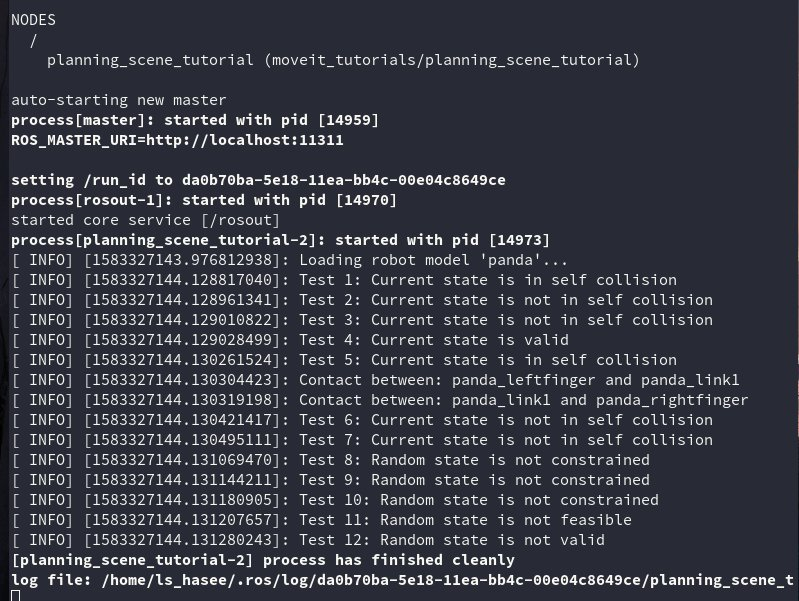

# PlanningScene类的构建
PlanningScene类可以由RobotModel或者URDF、SRDF得到。也可由PlanningSceneMonitor得到。
```
  robot_model_loader::RobotModelLoader robot_model_loader("robot_description");
  robot_model::RobotModelPtr kinematic_model = robot_model_loader.getModel();
  planning_scene::PlanningScene planning_scene(kinematic_model);
```
# 碰撞检测
## 自碰撞检查
先构建CollisionRequest对象和CollisionResult对象，把他们传入checkSelfCollision函数。自碰撞检测由URDF给出的渲染模型决定。
```
  collision_detection::CollisionRequest collision_request;
  collision_detection::CollisionResult collision_result;
  planning_scene.checkSelfCollision(collision_request, collision_result);
  ROS_INFO_STREAM("Test 1: Current state is " << (collision_result.collision ? "in" : "not in") << " self collision");
```
## 改变状态
获取当前状态病进行自碰撞检测。
```
  robot_state::RobotState& current_state = planning_scene.getCurrentStateNonConst();
  current_state.setToRandomPositions();
  collision_result.clear();
  planning_scene.checkSelfCollision(collision_request, collision_result);
  ROS_INFO_STREAM("Test 2: Current state is " << (collision_result.collision ? "in" : "not in") << " self collision");
```
## 不同控制组间的碰撞检查
检查手与机械臂间的自碰撞，即将组名“hand”加入collision request。
```
  collision_request.group_name = "hand";
  current_state.setToRandomPositions();
  collision_result.clear();
  planning_scene.checkSelfCollision(collision_request, collision_result);
  ROS_INFO_STREAM("Test 3: Current state is " << (collision_result.collision ? "in" : "not in") << " self collision");
```
##获取碰撞信息
首先移动机械臂到一个自碰撞的位置。
```
  std::vector<double> joint_values = { 0.0, 0.0, 0.0, -2.9, 0.0, 1.4, 0.0 };
  const robot_model::JointModelGroup* joint_model_group = current_state.getJointModelGroup("panda_arm");
  current_state.setJointGroupPositions(joint_model_group, joint_values);
  ROS_INFO_STREAM("Test 4: Current state is "
                  << (current_state.satisfiesBounds(joint_model_group) ? "valid" : "not valid"));
```
设置collision_request.contacts为true，遍历collision_result.contacts获得碰撞的信息。
```
  collision_request.contacts = true;
  collision_request.max_contacts = 1000;

  collision_result.clear();
  planning_scene.checkSelfCollision(collision_request, collision_result);
  ROS_INFO_STREAM("Test 5: Current state is " << (collision_result.collision ? "in" : "not in") << " self collision");
  collision_detection::CollisionResult::ContactMap::const_iterator it;
  for (it = collision_result.contacts.begin(); it != collision_result.contacts.end(); ++it)
  {
    ROS_INFO("Contact between: %s and %s", it->first.first.c_str(), it->first.second.c_str());
  }
```
## Allowed Collision Matrix(ACM矩阵)
ACM矩阵可以让检测程序忽略指定物体间的碰撞。
```
  collision_detection::AllowedCollisionMatrix acm = planning_scene.getAllowedCollisionMatrix();
  robot_state::RobotState copied_state = planning_scene.getCurrentState();

  collision_detection::CollisionResult::ContactMap::const_iterator it2;
  for (it2 = collision_result.contacts.begin(); it2 != collision_result.contacts.end(); ++it2)
  {
    acm.setEntry(it2->first.first, it2->first.second, true);
  }
  collision_result.clear();
  planning_scene.checkSelfCollision(collision_request, collision_result, copied_state, acm);
  ROS_INFO_STREAM("Test 6: Current state is " << (collision_result.collision ? "in" : "not in") << " self collision");
```
## checkCollision函数
该函数可以同事检查自碰撞和机器人与环境间的碰撞。
```
  collision_result.clear();
  planning_scene.checkCollision(collision_request, collision_result, copied_state, acm);
  ROS_INFO_STREAM("Test 7: Current state is " << (collision_result.collision ? "in" : "not in") << " self collision");
```

# 检查限制
限制检查包括运动学限制（如关节限制、位置限制、方向限制和可见性限制）与自定义限制。
## 运动学限制
定义运动学限制：
```
  std::string end_effector_name = joint_model_group->getLinkModelNames().back();

  geometry_msgs::PoseStamped desired_pose;
  desired_pose.pose.orientation.w = 1.0;
  desired_pose.pose.position.x = 0.3;
  desired_pose.pose.position.y = -0.185;
  desired_pose.pose.position.z = 0.5;
  desired_pose.header.frame_id = "panda_link0";
  moveit_msgs::Constraints goal_constraint =
      kinematic_constraints::constructGoalConstraints(end_effector_name, desired_pose);
```
将限制以及一个随机的机器人位置传入isStateConstrained函数判断该状态是否在限制内。
##自定义限制
自定义一个stateFeasibilityTestExample函数对自定义的限制进行判断。然后向setStateFeasibilityPredicate函数传入自定义函数句柄来对当前状态进行检测。
```
bool stateFeasibilityTestExample(const robot_state::RobotState& kinematic_state, bool verbose)
{
  const double* joint_values = kinematic_state.getJointPositions("panda_joint1");
  return (joint_values[0] > 0.0);
}

planning_scene.setStateFeasibilityPredicate(stateFeasibilityTestExample);
bool state_feasible = planning_scene.isStateFeasible(copied_state);
ROS_INFO_STREAM("Test 11: Random state is " << (state_feasible ? "feasible" : "not feasible"));
```
---
# 运行结果

