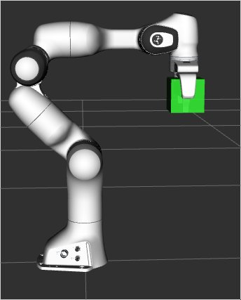

# PlanningScene, PlanningSeneMonitor, RobotState等的区别
## RobotState
RobotState是机器人的一个快照，包含了机器人的几何信息和关节角。
## CurrentStateMonitor
CurrentStateMonitor可以被看成是RobotState的一个包装，它订阅JointState消息，获得不断更新的关节角信息，用这些信息更新自己内部的RobotState。
## PlanningScene
PlanningScene可以被看做是整个场景的一个快照，它包括了RobotState和其他的有交互的外部物体。通常这个类用于检测碰撞和获得环境信息。
## PlanningSeneMonitor
PlanningSeneMonitor用ROS interface包装了PlanningScene，使自己内部的这个被包装的PlanningScene持续更新。可用的已有PlanningSceneMonitor有：LockedPlanningSceneRW和LockedPlanningSceneRO。  
该类中的成员包括：  
- :planning_scene_monitor:CurrentStateMonitor用于追踪RobotState信息。
- OccupancyMapMonitor用于追踪OccupancyMap  

PlanningSceneMonitor的订阅者包括：  
- collision_object_subscriber
- planning_scene_world_subscriber
- attached_collision_object_subscriber  

PlanningSceneMonitor的服务包括：
- get_scene_service
- startSceneMonitor
- startWorldGeometryMonitor
- startStateMonitor
- startPublishingPlanningScene
- providePlanningSceneService
## PlanningSceneInterface
是个用于向PlanningSceneMonitor发布更新的C++ API。

# PlanningScene ROS API
PlanningScene的ROS API是由“diffs”实现的。PlanningScene diff是当前planning scene（由move_group维护）和使用者的期望planning scene间的差异。
## 启动程序
一个终端执行命令：
```
roslaunch panda_moveit_config demo.launch
```
另一终端执行命令：
```
roslaunch moveit_tutorials planning_scene_ros_api_tutorial.launch
```
## 可视化部分 
MoveItVisualTools包提供了可视化物体、机器人、轨迹的方法。
```cpp
  moveit_visual_tools::MoveItVisualTools visual_tools("panda_link0");
  visual_tools.deleteAllMarkers();
```
## 发布必需的话题
创建一个publisher然后等待订阅。
```cpp
  ros::Publisher planning_scene_diff_publisher = node_handle.advertise<moveit_msgs::PlanningScene>("planning_scene", 1);
  ros::WallDuration sleep_t(0.5);
  while (planning_scene_diff_publisher.getNumSubscribers() < 1)
  {
    sleep_t.sleep();
  }
  visual_tools.prompt("Press 'next' in the RvizVisualToolsGui window to start the demo");
```
## 定义连结物体的消息
用消息来添加或减少物体并把物体连结在机器人上。
```cpp
  moveit_msgs::AttachedCollisionObject attached_object;
  attached_object.link_name = "panda_leftfinger";
  /* The header must contain a valid TF frame*/
  attached_object.object.header.frame_id = "panda_leftfinger";
  /* The id of the object */
  attached_object.object.id = "box";

  /* A default pose */
  geometry_msgs::Pose pose;
  pose.orientation.w = 1.0;

  /* Define a box to be attached */
  shape_msgs::SolidPrimitive primitive;
  primitive.type = primitive.BOX;
  primitive.dimensions.resize(3);
  primitive.dimensions[0] = 0.1;
  primitive.dimensions[1] = 0.1;
  primitive.dimensions[2] = 0.1;

  attached_object.object.primitives.push_back(primitive);
  attached_object.object.primitive_poses.push_back(pose);

  // Note that attaching an object to the robot requires
  // the corresponding operation to be specified as an ADD operation.
  attached_object.object.operation = attached_object.object.ADD;

  // Since we are attaching the object to the robot hand to simulate picking up the object,
  // we want the collision checker to ignore collisions between the object and the robot hand.
  attached_object.touch_links = std::vector<std::string>{ "panda_hand", "panda_leftfinger", "panda_rightfinger" };
```
## 向环境中添加一个物体
向环境中添加物体需要把物体添加到planning scene的世界部分中的碰撞物体集里。
```cpp
  ROS_INFO("Adding the object into the world at the location of the hand.");
  moveit_msgs::PlanningScene planning_scene;
  planning_scene.world.collision_objects.push_back(attached_object.object);
  planning_scene.is_diff = true;
  planning_scene_diff_publisher.publish(planning_scene);
  visual_tools.prompt("Press 'next' in the RvizVisualToolsGui window to continue the demo");
```
## 和move_group交互的两种方式
两种方式：同步和异步：
- 通过rosservice发送diff，rosservice是同步的，发送后阻塞直到diff被应用。（同步方式）
- 通过topic发送diff, topice是异步的，发送后不堵塞。（异步方式）  
上面的使用异步方式，若用同步方式，使用以下代码：
```cpp
  ros::ServiceClient planning_scene_diff_client =
      node_handle.serviceClient<moveit_msgs::ApplyPlanningScene>("apply_planning_scene");
  planning_scene_diff_client.waitForExistence();
  // and send the diffs to the planning scene via a service call:
  moveit_msgs::ApplyPlanningScene srv;
  srv.request.scene = planning_scene;
  planning_scene_diff_client.call(srv);
```
## 将物体连结在机器人上
用来表示机器人抓起一个环境中的物体，使其他与机械臂以及被抓物体交互的其他物体知道被抓物体和机器人是一体的。  
连结物体分两步：
1. 从环境中移除该物体
2. 把物体粘在机器人上
```cpp
  moveit_msgs::CollisionObject remove_object;
  remove_object.id = "box";
  remove_object.header.frame_id = "panda_link0";
  remove_object.operation = remove_object.REMOVE;

  // Note how we make sure that the diff message contains no other
  // attached objects or collisions objects by clearing those fields
  // first.
  /* Carry out the REMOVE + ATTACH operation */
  ROS_INFO("Attaching the object to the hand and removing it from the world.");
  planning_scene.world.collision_objects.clear();
  planning_scene.world.collision_objects.push_back(remove_object);
  planning_scene.robot_state.attached_collision_objects.push_back(attached_object);
  planning_scene_diff_publisher.publish(planning_scene);

  visual_tools.prompt("Press 'next' in the RvizVisualToolsGui window to continue the demo");
```
## 从机器人上分离物体
分离物体分两步：
1. 分离物体
2. 把物体重新加进环境中
```cpp
  /* First, define the DETACH object message*/
  moveit_msgs::AttachedCollisionObject detach_object;
  detach_object.object.id = "box";
  detach_object.link_name = "panda_link8";
  detach_object.object.operation = attached_object.object.REMOVE;

  // Note how we make sure that the diff message contains no other
  // attached objects or collisions objects by clearing those fields
  // first.
  /* Carry out the DETACH + ADD operation */
  ROS_INFO("Detaching the object from the robot and returning it to the world.");
  planning_scene.robot_state.attached_collision_objects.clear();
  planning_scene.robot_state.attached_collision_objects.push_back(detach_object);
  planning_scene.robot_state.is_diff = true;
  planning_scene.world.collision_objects.clear();
  planning_scene.world.collision_objects.push_back(attached_object.object);
  planning_scene.is_diff = true;
  planning_scene_diff_publisher.publish(planning_scene);

  visual_tools.prompt("Press 'next' in the RvizVisualToolsGui window to continue the demo");
```
## 从场景的碰撞物体集中移除物体
利用之前定义的物体的消息即可。
```cpp
  ROS_INFO("Removing the object from the world.");
  planning_scene.robot_state.attached_collision_objects.clear();
  planning_scene.world.collision_objects.clear();
  planning_scene.world.collision_objects.push_back(remove_object);
  planning_scene_diff_publisher.publish(planning_scene);
  // END_TUTORIAL

  visual_tools.prompt("Press 'next' in the RvizVisualToolsGui window to end the demo");
```
# 运行结果

